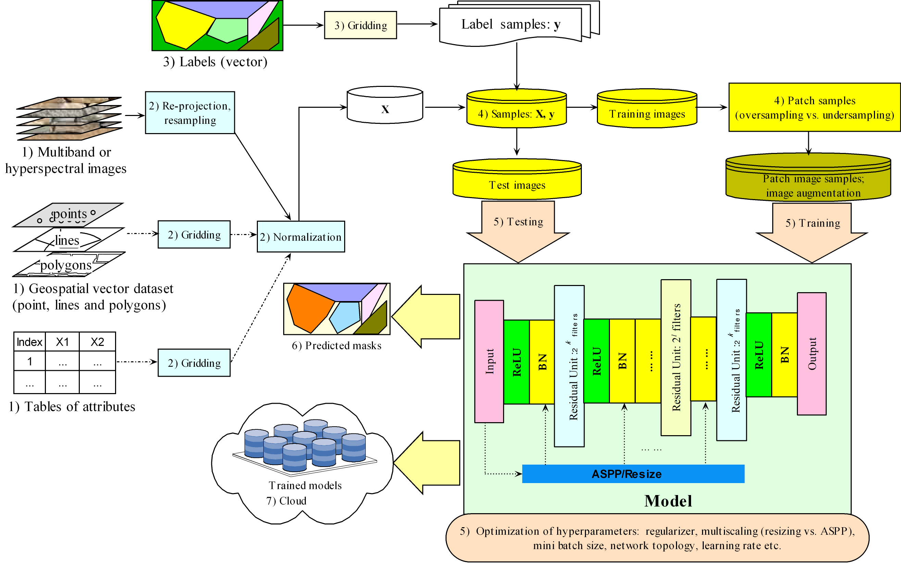

resmcseg: Library for Deep Residual Multiscale Segmenter
================

### Introduction

This package provides The python library of Deep Residual Multiscale Segmenter (autonet). Current version just supports the KERAS package of deep learning and will extend to the others in the future. The following functionaity is provoded in this package: \* model gResMCSeg: major class to obtain a deep extensive residual multiscale FCN. You can setup its aruments. See the class and its member functions' help for details.
gResMCSegPre: major class to make semantic segmentation for binary and multi class. pretrainedmodel: function to download the pretrained models using the DSTL and ZURICH datasets from the Google cloud \* util segmetrics: main metrics including jaccard index, MIoU, and loss functions etc. helper: helper functions including color mapping etc.

-   data data: function to access one image for Zurich to test the model's prediction.

### Installation of the package

1.  You can directly install this package using the following command for the latest version:

          pip install resmcseg 

2.  You can also clone the repository and then install:

         git clone --recursive https://github.com/lspatial/resmcsegpub.git
         cd resmcseg 
         pip install ./setup.py install 

Then, the following code is to import the necessary packages:

``` python
import numpy as np
import numpy.random as nr
import math
import keras 
```

``` python
from keras.callbacks import ModelCheckpoint

from sklearn import preprocessing
from sklearn.model_selection import train_test_split
import os
import pandas as pd 

import resmcseg as seg  
```

### Architecture

The architecture is based on the encoding-decoding antoencoder. Extensive residual connections were used in and between the encoding and decoding layers to enhance the learning with fusion of multiscale information of the input for semantic segmentation. 

Residual connections have been extended within and between the encoding/decoding layers, thus boosting learning efficiency, and multiscale information of the input via ASPP or resizing has also been fused within the architecture.

### Workflow of implementation

A workflow of implementation under geospatial context is represented here. In this workflow, the predictors from geospatial dataset or/and the other attributes are also considered; re-projection and resampling used to processing geospatial dataset are also included. In total, seven steps are summarized for this workflow graph. 

1.  Input predictors (X): besides the multiband or/and hyperspectral images, potential data sources from other geographical information science (GIS) (e.g., vector data of points, lines and polygons) and attributes database are also considered although not used in the test cases (thus presented in the dash-dot lines in this graph). These data may help improve semantic segmentation and thus is contained in the workflow.
2.  Preprocessing of the input predictors: preprocessing involves re-projection, resampling of the images at different spatial resolutions using bilinear interpolation to obtain the samples at a consistent target resolution and coordinate system, gridding of vector data, and normalization. For re-projection, resampling and gridding, the raster library (<https://cran.r-project.org/web/packages/raster>) of the R software provides the relevant functionalities. Normalization aims to remove the difference in the value scale between different predictors to improve learning efficiency. The Python’s scikit package (<https://scikit-learn.org>) provides a convenient normalization function.
3.  Input labels (y): the label data are essential for training of the models. Usually, the label data of vector format (points, lines or polygons) are obtained manually and must be gridded into the masks at the target resolution. A summary for the proportion of pixels for each label class can be conducted in this step.
4.  Merging of the data, sampling and image augmentation: this involves merging of the predictor and label data (X and y), random split of the training and test samples, patch sampling for the training samples by oversampling or undersampling, and image augmentation. As aforementioned in Section 3.4, patch sampling is to divide a large image into small patches for the purpose of training, and the summary of the pixel proportion for each class can be used to determine a strategy of patch sampling. Then, the training set (both images and masks) was randomly augmented at training time with rotations by 45 degrees, 15-25% zooms/translations, shears, and vertical and horizontal flips.
5.  Training and testing: this involves construction, training and testing of the models and grid search to obtain optimal hyperparameters (e.g., regularizer, network topology, multiscaling choice, mini batch size, and learning rate). The published Python package of core algorithm, resmcseg, can be used to construct the proposed model with flexibility of different choices of hyperparameters. With different hyperparameters and their combinations, grid search \[85\] can be conducted to find an optimal solution for these hyperparameters.
6.  Prediction: this involves use of the trained models to predict the land-use mask of the new dataset. In addition, the predicted mask can be converted into the output of vector format for use under geospatial context.
7.  Pre-trained models in cloud: the trained models can be stored as the pre-trained models in the cloud platform (e.g., Amazon Web Services or Google Cloud), and can be called later for predicting or as the basic models for further training.

### Construction and training of the models

Set up the following parameters and construct the deep residual multiscale models. For details of each parameter, please see the help document in the package.

``` python
 ... ...
 train_gen,val_gen=dataload_klsat(**v) # Use the generator to generate minibatch images 
 defkwargs={'inc_step': 2, 'up2deconv': True, 'activation': 'relu', 'nfeature': 0, 'dropout': 0.5, 'batchnorm': True,
         'cropsize': None, 'ismaxpool': True, 'isconvcon': False, 'k_initializer': 'glorot_uniform',
         'residual': True, 'residualAutoType': 1, 'multsctype': 'dilated', 'mctotallevels': 10,
         'mcbothcoder': False, 'mcfilters': [16 for i in range(10)]}
 modelCls = seg.model.gResMCSeg(input_shape=inputshape, start_filter= 32, depth=5, **kwargs)
 model = modelCls.ResMCNet(outfilter=outfilter,ngpu=2)
 model.summary()
 model.compile(optimizer="adam", loss= k_njibce_loss,metrics=['accuracy',k_njibce_loss,k_ji,miou])
 model_json = model.to_json()
 with open(tPath+'/model_frame.json', 'w') as json_file:
           json_file.write(model_json)
 modelFl = tPath+'/model_weight.hd5'
 early_stopping = EarlyStopping(patience=30,monitor='val_categorical_crossentropy', verbose=1)
 model_checkpoint = ModelCheckpoint(modelFl,monitor='val_categorical_crossentropy', save_best_only=True, verbose=0)
 reduce_lr = ReduceLROnPlateau(factor=0.1,monitor='val_categorical_crossentropy', patience=5, min_lr=0.00001, verbose=0)
 fhist = model.fit_generator(generator=train_gen, verbose=1, epochs=nepoch, validation_data=val_gen, 
          callbacks=[early_stopping, model_checkpoint, reduce_lr],use_multiprocessing=True, workers=10)
 modeloneFl = tPath + '/model_strwei.h5'
 model.save(modeloneFl)
 scores=model.evaluate(x=testX,y=testY)
 print("accuracy:",scores[0],", Jaccard index:",scores[2],", MIoU:",scores[3])
```

### Downloading of the pretrained model and predictions

The pretrained models can be downloaded from the Google cloud and used to make the prediction.

``` python
import os
import cv2
from keras.models import load_model,model_from_json
from resmcseg.util.segmetrics import compute_iou,jaccard,mean_iouC,miou,mean_iou
from resmcseg.model.gresmcseg_pre import gResMCSegPre
from resmcseg.model.resizelayer import ResizeLayer
from resmcseg.model.pretrainedmodel import downloadPretrainedModel
from resmcseg.util.helper import bce_dice_loss,jaccard_coef,jaccard_coef_int,jaccard_coef1
from resmcseg.util.helper import onehot_to_rgb,color_dict
from resmcseg.data import dload
import numpy as np
import matplotlib.pyplot as plt 

def getResImg(resimg):
    return onehot_to_rgb(resimg, color_dict)

os.environ["CUDA_DEVICE_ORDER"] = "PCI_BUS_ID"
os.environ["CUDA_VISIBLE_DEVICES"] = str('0')

modelFl='/tmp/model_strwei.h5'
if not os.path.isfile(modelFl):
   downloadPretrainedModel('ZURICH',destination=modelFl) 
model = load_model(modelFl,custom_objects={'ResizeLayer': ResizeLayer,'bce_dice_loss':bce_dice_loss,
        'mean_iou':mean_iou,'jaccard_coef':jaccard_coef, 'jaccard_coef1':jaccard_coef1,'miou':miou,
        'jaccard_coef_int':jaccard_coef_int,'mean_iouC': mean_iouC})
ppre=gResMCSegPre(patchsize=224,bordersize=16,overprop=0.3)
img, mask = dload()
```

``` python
imgres = ppre.preAImgMulti(img, model, 9)
```

``` python
mskImg = getResImg(imgres)
fpath = "/tmp/zurich1img_pre.jpg"
cv2.imwrite(fpath, cv2.cvtColor(mskImg, cv2.COLOR_RGB2BGR), [int(cv2.IMWRITE_JPEG_QUALITY), 100])
```

``` python
y_pred = imgres.flatten()
y_true = mask.flatten()
iou = compute_iou(imgres, mask)
jacard = jaccard(imgres, mask)
print("iou : " + str(iou) + '; jacard is ', jacard)
```

``` python
mask=getResImg(mask)
print(img.shape,",",mask.shape,",",mskImg.shape)
```

``` python
f, axarr = plt.subplots(1, 3,figsize=(36,12))
axarr[0].imshow(img[:,:,[0,1,2]])
axarr[0].set_title("Original image")
axarr[0].axis('off')
```

``` python
axarr[1].imshow(mask)
axarr[1].set_title("Mask")
axarr[1].axis('off')
```

``` python
axarr[2].imshow(mskImg)
axarr[2].set_title("Predicted mask")
axarr[2].axis('off')
```

``` python
plt.tight_layout(True)
plt.show()
```


### Sample images, ground truth and predicted masks

The following samples are three images for each dataset of the DSTL and Zurich dataset!

<p style="float: left; font-size: 9pt; text-align: center; width: 46%;height: 100%; margin-right: auto; margin-bottom: 0.5em;">
DSTL images
</p>
<p style="float: left; font-size: 9pt; text-align: center; width: 54%;height: 100%; margin-right: auto; margin-bottom: 0.5em;">
Zurich images
</p>
''

<P style="page-break-before: always">
Contact

For this library and its relevant complete applications, welcome to contact Dr. Lianfa Li. Email: <lspatial@gmail.com>
